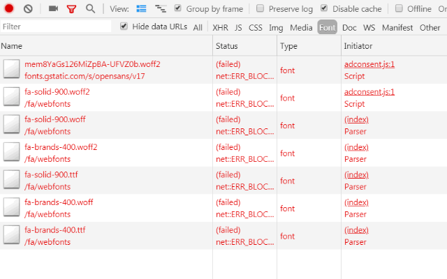
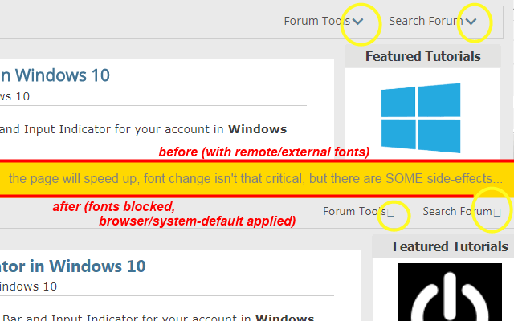

<h1> API-Killer-Font</h1>

☞︎ No: \[remote-fonts|CSS Font Loading|FontFace interface\]. Optional Tip: Chrome: --disable-remote-fonts / Firefox: gfx.downloadable_fonts.enabled - false .  

requests to font-files will be blocked,  
responses of font-files will be blocked.

a lot of future and past font-related API will be nullified:
https://developer.mozilla.org/en-US/docs/Web/API/FontFace  
https://developer.mozilla.org/en-US/docs/Web/API/CSS_Font_Loading_API  
https://developer.mozilla.org/en-US/docs/Web/CSS/@font-face  
https://developer.mozilla.org/en-US/docs/Web/API/HTMLFontElement  
https://developer.mozilla.org/en-US/docs/Web/HTML/Element/font  

<strong>that's a double background firewall and a client-side nullification!</strong>

Warning: a lot of websites uses "font awesome" or similar to provide you with icons,  
(using a discarded/unused Unicode characters), you most likely see "squares" (<a href="https://en.wikipedia.org/wiki/Noto_fonts#Etymology">also known as "tofu"</a>) where text-based icons usually would be placed.  

Websites can try to specify a default font that is installed on your system,  
as well as generic monospace, sans-serif, serif which means using the browser's default (or defined font for those).  

  
  

You can see the recent changes in <code>changelog.nfo</code>.

<a href="https://github.com/eladkarako/chrome_extensions/issues/new?title=API-Killer-Font%20-%20"><em><code>ask something/report a bug</code></em></a>  
<a href="https://paypal.me/e1adkarak0/5USD"><em>buy me a coffee ☕︎</em></a>  
