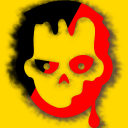

<h1> API-Killer-Mutation</h1>

<strong>☞︎ Kills Mutation API - legacy MutationEvent-types and the newer MutationObserver.</strong>  

Kills Mutation API,  
legacy MutationEvent types (DOMAttrModified, DOMAttributeNameChanged, <a href="https://developer.mozilla.org/en-US/docs/Web/Guide/Events/Mutation_events#Mutation_events_list>etc...</a>),  
and the newer <a href="https://developer.mozilla.org/en-US/docs/Web/API/MutationObserver">MutationObserver</a>.  

<a href="https://github.com/eladkarako/chrome_extensions/issues/new?title=API-Killer-Mutation%20-%20"><em><code>ask something/report a bug</code></em></a>  
<a href="https://paypal.me/e1adkarak0/5"><em>buy me a coffee ☕︎</em></a>  
