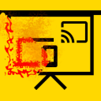

<h1> API-Killer-Presentation</h1>

<strong>☞︎ Kills JavaScript Presentation API ( https://developer.mozilla.org/docs/Web/API/Presentation_API ).</strong>

See <a href="https://developer.mozilla.org/docs/Web/API/Presentation_API">https://developer.mozilla.org/docs/Web/API/Presentation_API</a>  
and <a href="https://www.w3.org/TR/presentation-api/">https://www.w3.org/TR/presentation-api/</a> for the specifications of the API.  

This web-extension kills the JavaScript objects and methods used by the page,  
in-order to establish a connection,  
but it does not kills related APIs such as WebRTC (or WebSockets),  
no setting-changing component,  
see API-Killer-WebRTC and API-Killer-WebSockets.

There is no active "network-blocking" component, at least for now.  
such component (future) might be targeting requests of the discovery protocol ("DIAL"),  
SSDP (Simple Service Discovery Protocol), or even pin-point REST or simply HTTPS requests  
( <a href="http://www.dial-multiscreen.org/dial-protocol-specification">http://www.dial-multiscreen.org/dial-protocol-specification</a> ).

Note: if a web-page is blocking executing of javascript from web-extensions,  
this web-extension will not be able to block this API!

<a href="https://github.com/eladkarako/chrome_extensions/issues/new?title=API-Killer-Battery%20-%20"><em><code>ask something/report a bug</code></em></a>  
<a href="https://paypal.me/e1adkarak0/5USD"><em>buy me a coffee ☕︎</em></a>  
