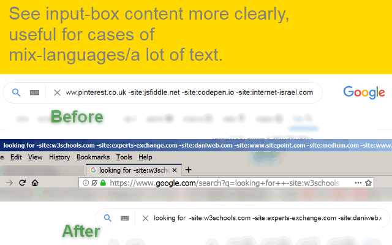

<h1> Align-Left</h1>

<strong>☞︎ align input text-elements to the left (Hebrew/Arabic too, but the direction is set to RTL for readability).</strong>  
  
=-=-=-=-=-=-=-=-=-=-=-=-=-=-=-=-=-=-=-=  

<strong>Developer's HUB</strong>
<strong><em>Where I Tell How The Web-Extension Works..</em></strong>

The algorithm scans the page and discovers new input elements without the attribute <code>type</code>, or with the attribute <code>type</code> set to <code>text</code>, or if <code>type</code> is empty.  
Discovering elements can happen across many moments in the page life-cycle, including dynamic build pages, this web-extension tries to handle those cases by trying to rediscover elements multiple times in pages early loading, dom-ready, window.onload as well as on page's resize and visibility change, transition-end, ready-state/popstate/spf/yt-page/loadend events which may be triggered in dynamic-generated pages. This web-extension also uses a special "timer", not the setTimeout nor the setInterval ones, but an "alarm" which is set to repeat launch every 1-minute (but flexible to delay in-case high-load).  

Each element is then "flagged" with the attribute <code>data-alignleft</code>, so it won't be rediscovered on page's many possible rediscover-triggers,  
this "flag" has another reason, it allows a generic CSS-matching in the injected CSS, so in the future the functionality could be extended and not be limited to the query at the moment, this mechanism also makes the program more flexible, and the query-string that looks for element independent from the CSS rules - - - if the JavaScript sets the "flag" the CSS will handle it, regardless the actual element is and conditions are.  

The main action is setting the "flag" <code>data-alignleft</code> attribute as soon as possible,  
next is assigning a <code>DIR</code> attribute - to <code>LTR</code>,  
if the element has textual content that includes any Hebrew/Arabic characters (Unicode-range check),  
the <code>DIR</code> attribute is assigned <code>RTL</code>.

The CSS file is already loaded in the page in a very early stage, 
and when it "sees" any element with the <code>data-alignleft</code> attribute,  
it will set a "hard" CSS rule to <code>text-align: left</code>,  
if an element have <code>DIR</code> attribute set to <code>RTL</code>, it also sets the CSS-rule <code>direction: rtl</code>, otherwise <code>direction: ltr</code>. 

The textual-content of the element might change, 
but it will always have <code>text-align: left</code> rule "hard set", 
the changing of the direction minor helpful thing to correct the readability when there is a mixed of languages along with Hebrew/Arabic or an additional of non-alpha-characters.  

When changing the <code>DIR</code> attribute,  
one of the two <code>direction: </code> rule will apply automatically. 

To help figuring out if the content has changed,  
there are event triggered set on <code>mouseup</code> (will be triggered with touch events too ) and <code>keyup</code>,  
the on <code>change</code> event is too accurate, and will make the event-handler memory hogging.  

The icon of the web-extension shows a number when there are elements that were discovered and effected,  
the number should keep still when the page has done loading, unless the page has a dynamic way of building UI-elements,  
if so you may see the number increase as new input-text elements are created.  

=-=-=-=-=-=-=-=-=-=-=-=-=-=-=-=-=-=-=-=  

I've basically made this web-extension for myself, and then decided to share it with everyone, because sharing is caring. it's nothing fancy but it is small, quick and it works. If you've enjoyed using it I'll be thrilled to hear all about it in the review section. 

=-=-=-=-=-=-=-=-=-=-=-=-=-=-=-=-=-=-=-=  

100% free (as beer..), no ads (I hate those!), no cookies, NO data collection, NO analytics, NOT accessing FS, NOT sending or receiving anything and works entirely offline.  
  
=-=-=-=-=-=-=-=-=-=-=-=-=-=-=-=-=-=-=-=  
  
  

=-=-=-=-=-=-=-=-=-=-=-=-=-=-=-=-=-=-=-=  

<a href="https://github.com/eladkarako/chrome_extensions/issues/new?title=Align-Left%20-%20"><em><code>ask something/report a bug</code></em></a>  
<a href="https://paypal.me/e1adkarak0/5USD"><em>buy me a coffee ☕︎</em></a>  
