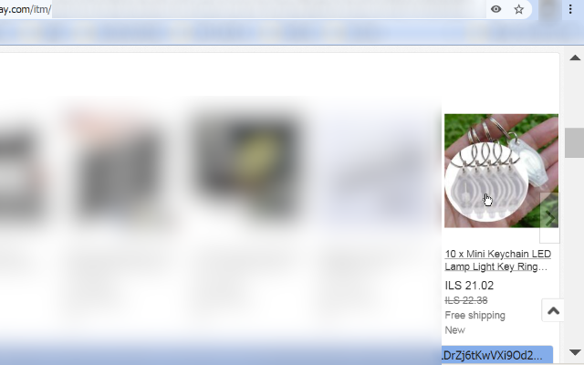

<h1> Anchor-Element-Add-Title</h1>

<strong>☞︎ Add A Title-Attribute (If Missing) To An \u003CA\u003E-Element, Based On The Internal-Text-Content of the element.</strong>

<code>&lt;A&gt;</code>-elements will display the content of their <code>title</code>-attribute when the mouse cursor is resting-above them,  
it is really useful and informative,  
but some websites won't include that,  
and sometimes it is really hard to read the actual textual-content,  
some websites may trim textual description, visually (CSS-rule <code>text-overflow:clip</code>, for example) to unify the website look, even if it cuts out useful information... 
the modern browsers do display a target-URL if the <code>&lt;A&gt;</code>-element includes an <code>href</code>-attribute, but that is not very helpful all the time,  

textual-content can be long,  
so I limit the length of each title to first 200 characters (should suit fine for most cases),  
and I also "break" (I.E. add new-line characters) long lines so the maximum width is 40-characters at the most,  
I'm trimming some whitespace, removing empty lines but that is it,  
this web-extension is not aware of what the textual-content actually is,  
the lack of actual content-aware filtering helps this web-extension be very simple and fast,  
but also may include some non-sense characters, repeating texts or do not include proper line-breaks - for example - in-case the content is visually formatted (for example using various CSS-rules instead of including actual new-line breaks or placing the content in several sub-elements which transforms to new-line characters when reading the element-'.innerText'-attribute. 
 
for example, in the eBay screenshots below you can see some repeating content,  
the old price is included twice,  
it is because eBay uses various mix of visual and actual formatting for elements,  
anyway <code>&lt;A&gt;</code>-element may wrap-around an <code>&lt;IMG&gt;</code>-element which sometimes has <code>alt</code> attribute, which is read as a text, and added to any text-nodes or other elements interal-text. 

This web-extension does not actually modify any content, it just adds an internal-attribute which the browser may or may not display as a tooltip when a mouse cursor is hovering above the element, this browser-setting may be disabled using the browser's own various command-lines, configurations or switches,  
this web-extension does not handle the tooltip presentation/rendering in anyway, and other than the attribute-adding thing, it does not modify the web-page (- Document-Object-Model, DOM) in any way. 

The number that is shown in the web-extension icon represent the amount of <code>&lt;A&gt;</code>-elements on the page that got fixed,  
I.E. - that were not having a <code>title</code>-attribute, and now have. 

This web-extension works on all HTML-pages (not XML, text or various other format that are too presentable in the browser), and on every sub-frame on the page, including frames that were dynamicly-created (for example from <code>about:blank</code> frames),  
and this web-extension does not work on pages or sub-frames that points to <code>chrome://*</code>. 

This web-extension does not hog-CPU, it is very efficient, it runs every minute and only try to "discover" elements without title, directly, without querying all the elements on the page and testing for them one by one, 
and this web-extension tries to re-discover elements on dynamic-build pages by listening to events fired on content change,  
other than that this web-extension tries to re-discover elements about every 1-minute, managed by a browser using the "Alarm"-API (not using "setTimeout" nor "setInterval"). 

I've basically made this web-extension for myself, and then decided to share it with everyone, because sharing is caring. it's nothing fancy but it is small, quick and it works. If you've enjoyed using it I'll be thrilled to hear all about it in the review section. 

This web-extension is 100% client-side JavaScript, it means that if the page has strict-policy that deny JavaScript from web-extensions from running, this web-extension will not work (and there is not much to do about it..). 

100% free (as beer..), include no ads (I hate those!), does NOT collect any data, does NOT store any data, does NOT make use of cookies (nor storage of any kind such as localStorage/sessionStorage/indexedDB/WebSQL/...), it does NOT uses settings, it does NOT uses the profile/sync data, it includes NO analytics and works entirely offline. 

  
  

You can see the recent changes in <code>changelog.nfo</code>.

<a href="https://github.com/eladkarako/chrome_extensions/issues/new?title=Anchor-Element-Add-Title%20-%20"><em><code>ask something/report a bug</code></em></a> 
<a href="https://paypal.me/e1adkarak0/5USD"><em>buy me a coffee ☕︎</em></a> 
