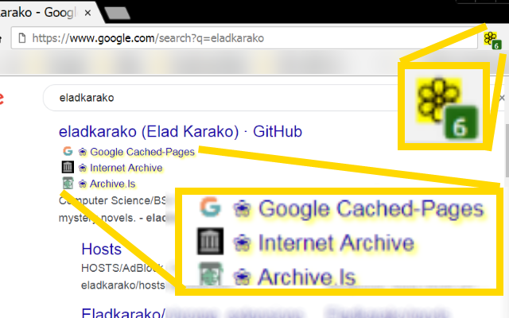

<h1> Archive-Links</h1>

<strong>☞︎ Google Cache, Archive.org, Archive.Is, WebCite.org - Mirrors - For Google-Search And DuckDuckGo.</strong>

  

  

Currently supports:
<pre>
https&#x003A;&#x002F;&#x002F;www.google.com/search
https&#x003A;&#x002F;&#x002F;www.google.co.il/search
https&#x003A;&#x002F;&#x002F;duckduckgo.com/html
https&#x003A;&#x002F;&#x002F;duckduckgo.com/
</pre>

If you need your language-search-page, open a new issue: <a href="https://github.com/eladkarako/chrome_extensions/issues/new?title=Archive-Links%20-%20Please%20add%support%for%my%language%20"><em><code>ask something/report a bug</code></em></a>  

I've basically made this web-extension for myself, and then decided to share it with everyone, because sharing is caring. it's nothing fancy but it is small, quick and it works. If you've enjoyed using it I'll be thrilled to hear all about it in the review section. 

100% free (as beer..), include no ads (I hate those!), does NOT collect any data, includes NO analytics and works entirely offline.

<a href="https://github.com/eladkarako/chrome_extensions/issues/new?title=Archive-Links%20-%20"><em><code>ask something/report a bug</code></em></a>  
<a href="https://paypal.me/e1adkarak0/5USD"><em>buy me a coffee ☕︎</em></a>  
