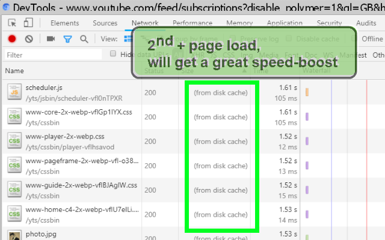

<h1> Boostaler</h1>

Chrome/Chromium based users: 

Newer (&gt; version <code>67.0.3396.99</code>) Chromium based browser <strong>uses a "Newer Network Service" which handles all the background traffic, and it is freaking slow</strong>, and it is <strong>extra buggy with stale (and boostaler)</strong>.

Here is the combination that work for me allowing a much faster rendering of pages, 
including activating two kinds of secondary cache, the stale feature, pre-connecting, QUIC protocol, <strong>and disabling the "Newer Network Service"</strong>, disabling limiting refresh rate to vsync signals, keeping renderd tab in memory longer which prevents lags, it also enables faster file-downloads. 
The browser will fallback to an eariler method of connection handling.

for it to work you must use a command-line (such as CMD or powershell for Windows or bash/sh for linux based OS). 
You may also use a launcher program such as https://github.com/eladkarako/iniRun .

note 1: that <code>--flag-switches-begin</code> and <code>--flag-switches-end</code> is optional, it helps you identify a group of flags within <code>chrome://version</code> more easily.

note 2: the following suite multiple versions of Chromium based browsers, both old and new. few of those switches (such as <code>brotli-encoding</code> feature) are already "switched-ON" by default in newer versions, even so, they are explicitly specified to suite older versions as well, if supported.

<code>--disable-features="AutomaticTabDiscarding,D3DVsync,NetworkService" --enable-features="StaleWhileRevalidate,StaleWhileRevalidate2,NoStatePrefetch,SpeculativePreconnect,ParallelDownloading,brotli-encoding,BackForwardCache:TimeToLiveInBackForwardCacheInSeconds/300/should_ignore_blocklists/true/enable_same_site/true" --enable-stale-while-revalidate --enable-offline-load-stale-cache --use-simple-cache-backend=on --save-previous-document-resources=onload --flag-switches-end</code>

The above switches even without <code>--enable-stale-while-revalidate --enable-offline-load-stale-cache</code> and <code>StaleWhileRevalidate,StaleWhileRevalidate2</code> should speed-up things quite a lot - and combining all of those with the boostaler web-extension "flags" every website as far as the browser knows to be able to use stale. without the network service, it works well.

I've been seeing a lot of non-accurate speculations regarding how Boostaler works, since I've published the boostaler web-extension, and by extent about how the browser's stale-feature work. A lot of confusion out there - I'll try to put it in the simplest terms, but it does get pretty technical, pretty fast..  

Boostaler ("boost" + "stale" if it wasn't obvious) edits a single HTTP-header named "Cache-Control",  
it adds (or modified) just the last part of the string-value of the HTTP-header,  
it is very subtle change, and browser may ignore it if they do not have internal-support for stale-feature just yet.

No. Boostaler does not prolong (or modify - in any way) the actual time a resource such as CSS or JS stays in the Cache. It is effectivly impossible since that part of the Cache-Control header is recived and parsed by the browser in an early stage that is byhond controling with the network-API.  
The stale-feature however can be set. It was decided by the feature editors that the way to activate this feature is by a small addition to the end of the Cache-Control, thus creating a lot of confusion, as the stale-feature is not really directly related to the classic cache system of the browser.  

The browser changes the way it operates when the stale-feature are enabled for a website.  
And this web-extension makes the browser thinks the stale-feature has been activated for EVERY website!  

Right. So what's all this now? you ask.  

Stale is basically telling the browser - "you know what, just ALWAYS serve the website and every resource that got with that header - from Cache, if you got any".  
Obviously that will not works the first time you'll be loading a website,  
but anyway this sounds HORRIBLE right??? always showing old content regardless (basically showing offline old copy of the website and its images, css, javascript, etc..). What a cr\^ppy idea!  

But wait! there is more into it!  

You remmember what I was saying (writing) before regarding how the browser changes the way it operates?  
OK - a new, additional, single process (although threaded I presume) network service starts running in the backgroud with extreamly low priourity. Its only job: "look at" items currently in the browser-cache, try to see if there is a new version of them online (remmember, it works in the background, you won't see this!),  
if that network service does finds a new copy, for example of an image, a CSS file or other resources that was marked with the stale-feature, it downloads it in the background, and replace "the really old" version, with the current version IN THE CACHE. It does nothing more.  
The next time the browser will check to see if there is a CSS-file (for example) available in the cache, it will unawarly serve the newly updated (by the background network-service) resource.  

If that is too hard to think of that,  
think of the a web resource as a slice of bread,  
in-fact, we have a whole bag of a freshly sliced bread,  
say you want two slices for a p.b.&amp;j, you normally grab two slices from the top.  
Now, we all aware that bread has a shelf-life-span of few of days, and then it gets stale,  
normally the slices near the opening of the bag gone-stale first, and eventually it all gone bad,  
and you need to buy a whole fresh one.  

now imagine (let's make it funny!) a person that its whole job is to finger/sniff or even (ewww) nibble at the edge of the first two slices every couple of seconds, once there is some stale'ness in them, he dumps them to the bin (or perhaps makes himself a slightly sandwitch), he then goes to the store and buys just two slices of fresh slices, comes back the bag of the existing bread, open the back of the bag, pushes the two fresh slices in the back of the bag and re-seal it shut.

He then goes back to keep probing the first two slices of bread again..  

You are unaware of the constant background-tasks of "too stale?" or "get new!".

once in a while you descide to try a new kind of bread,  
and you buy a new bag.

Once you come to make yourself a second p.b.&amp;j you get always get a "REASONLY FRESH" two slices from the top,  
moreover, you, yourself, never have to got a whole bag of sliced-bread again,  
you do probably pay some money for that service of course, 
and you're pretty happy with that.  

Now, this is obviously an overly-simplified model of how the browser (you),  
the stale-feature and the background-network service (that guy whom checks freshness and buys new slices).  

The browser can serve the same content (offline, from cache) any-number of times,  
while there is only so much amount of slices of bread in a bag..  

BUT I hope it helps you wrap your head around the concept.  

Some technical stuff,  
older Chrome versions needs <code>--enable-stale-while-revalidate --enable-offline-load-stale-cache</code>,  
newer Chrome versions needs <code>--enable-features="StaleWhileRevalidate2"</code>,  
tip (optional): <code>--use-simple-cache-backend=on</code> helps to speed up things,  
tip (optional): <code>--enable-features="BackForwardCache:TimeToLiveInBackForwardCacheInSeconds/300/should_ignore_blocklists/true/enable_same_site/true"</code> speeds up back forward navigating.  
tip (optional): wrapping <code>--flag-switches-begin</code> and <code>--flag-switches-end</code> helps you to quickly find your switches in <code>chrome://version</code> (has no effect other than that.  

I've combined it all,  
along other switches which are useful to me to:  
<code>--flag-switches-begin "--user-data-dir=D:\Software\Chromium\new\profile" --no-default-browser-check --ignore-autocomplete-off-autofill --allow-outdated-plugins --disable-logging --disable-breakpad --disable-crash-reporter --crash-server-url="https://0.0.0.0/" --no-pings --force-device-scale-factor="1.30" --ignore-certificate-errors --force-color-profile="srgb" --disable-features="OmniboxUIExperimentHideSteadyStateUrlSchemeAndSubdomains,OmniboxUIExperimentHideSteadyStateUrlTrivialSubdomains,OmniboxUIExperimentHideSteadyStateUrlPathQueryAndRef,OmniboxUIExperimentHideSteadyStateUrlScheme,ExtensionsToolbarMenu,MaterialDesignExtensions,MaterialDesignBookmarks,SafeSearchUrlReporting" --user-agent="Mozilla/5.0 (Windows NT 6.1; Win64; x64) AppleWebKit/537.36 (KHTML, like Gecko) Chrome/88.0.4284.0 Safari/537.36" --disable-canvas-aa --disable-2d-canvas-clip-aa --webgl-antialiasing-mode=none --disable-composited-antialiasing --ppapi-antialiased-text-enabled=0 --ppapi-subpixel-rendering-setting=0 --disable-font-subpixel-positioning --autoplay-policy=document-user-activation-required --default-tile-height=128 --default-tile-width=128 --num-raster-threads=4 --enable-features="ParallelDownloading,ScrollAnchoring,StaleWhileRevalidate2,OmniboxUIExperimentShowSuggestionFavicons,BackForwardCache:TimeToLiveInBackForwardCacheInSeconds/300/should_ignore_blocklists/true/enable_same_site/true" --enable-smooth-scrolling --enable-stale-while-revalidate --enable-offline-load-stale-cache --use-simple-cache-backend=on --flag-switches-end</code>

Since this is too long to be used in a Windows shortcut, and batch file leaves an ugly black console in the background until you close Chrome, I've built a "runner", essentially you download two files:  
https://github.com/eladkarako/Chromium/blob/master/new/run.ini  
and https://github.com/eladkarako/Chromium/blob/master/new/run.exe  
edit the run.ini, place them in the same folder (you can rename them both to other name) and start the run.exe  
https://github.com/eladkarako/Chromium is an umbrella-repository for many stuff I've used over the years,  
and currently use to start Chromium in a custom profile with some other switches.

Firefox should have support for stale-feature built-in, no switches needed.  
But it's not that well integrated as Chromium-based browsers is.  
You may try it, it should work OK'ish.  

Remember, this web-extension does nothing other than activate an existing browser-feature.

 

 
 
Here is the old explenation, for reference.
 

<strong>☞︎ 500% Speed Boost ⚡. Add to chrome's shortcut: --enable-stale-while-revalidate and --enable-offline-load-stale-cache</strong>

This web-extension will reconfigure the cache-control headers for each of the requests to the page's resources (such as CSS-file, images and media-files) allowing a much longer-period of time for each resource to stay in the browser-cache, but still checking to see if the resources is the most recent one available.
In additional it make use of an experimental addition to the cache-control headers called "stale-while-revalidate" allowing the resources to load "one more time" while the fresher, newer resource is being downloaded in the background, ready to be served in the next time. This whole magic is done by the browser, the Boostaler web-extension simply activates the cool-stuff you already have.

I've basically made this web-extension for myself, and then decided to share it with everyone, because sharing is caring. it's nothing fancy but it is small, quick and it works. If you've enjoyed using it I'll be thrilled to hear all about it in the review section. 

100% free (as beer..), include no ads (I hate those!), does NOT collect any data, include NO analytics and works entirely offline.

For Chrome please enable either <code>chrome://flags/#enable-stale-while-revalidate</code> or use the <code>--enable-stale-while-revalidate --enable-offline-load-stale-cache</code> command-line flag with <code>chrome.exe</code> for the full effect.

Firefox does not need setting any special configuration or switches.

 

<h3>This Extension Is A Great Way To Enhance Browsing :)</h3>

<h3>Read about:</h3>
stale in <code>Cache-Control</code> header: <a href="https://tools.ietf.org/html/rfc5861">https://tools.ietf.org/html/rfc5861</a> (includes examples- but technical).

<!--  -->

<a href="https://paypal.me/e1adkarak0/5USD"><em>buy me a coffee ☕︎</em></a>  
<a href="https://github.com/eladkarako/chrome_extensions/issues/new?title=Boostaler%20-%20"><em><code>ask something/report a bug</code></em></a>  
