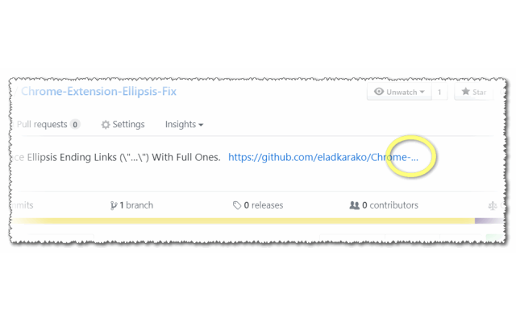
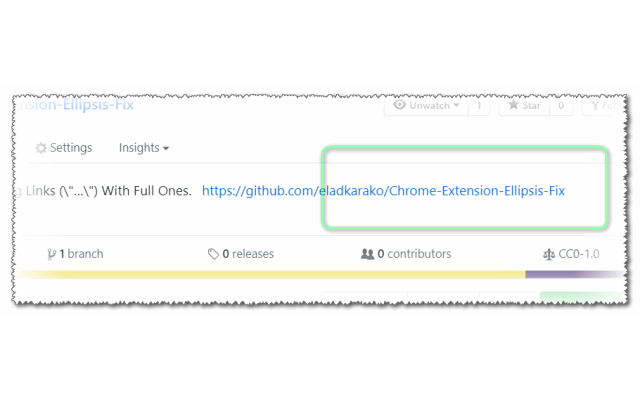
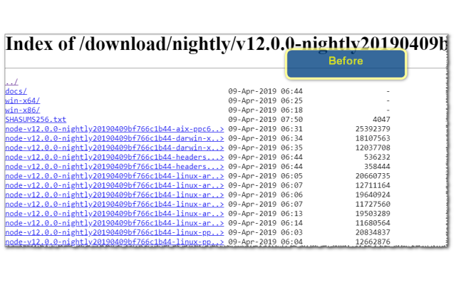
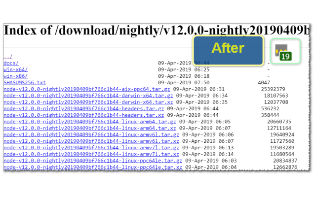

<h1> Ellipsis-Fix</h1>
<a href="https://paypal.me/e1adkarak0/5"><em>buy me a coffee ☕︎</em></a>  
<a href="https://github.com/eladkarako/chrome_extensions/issues/new?title=Ellipsis-Fix%20-%20"><em><code>ask something/report a bug</code></em></a>  

<strong>☞︎ Replace Ellipsis Ending Links (\"…\") With Full Ones.</strong>

<strong>When this web-extension will only work partially (not a full API-blocking)?</strong>
Some servers can prevent external-JavaScript from running on their pages, this includes JavaScript from web-extensions. It is usually done by serving the web-page with an additional 'Content-Security-Policy' header with the value 'default-src none', for example (https://addons.mozilla.org does it, and it prevents all, no just mine, web-extensions from working on that sub-domain). There isn't much to do in that matter, Firefox was designed to block web-extensions' JavaScript in those cases (yes, this web-extension's JavaScript too). When ever possible, I add an additional network-filter to each of my web-extension, for an increased security, those will always keep on working.

I've basically made this web-extension for myself, and then decided to share it with everyone, because sharing is caring. it's nothing fancy but it is small, quick and it works. If you've enjoyed using it I'll be thrilled to hear all about it in the review section. 

100% free (as beer..), include no ads (I hate those!), does NOT collect any data, includes NO analytics and works entirely offline.

  
  
  
  

<!--  -->