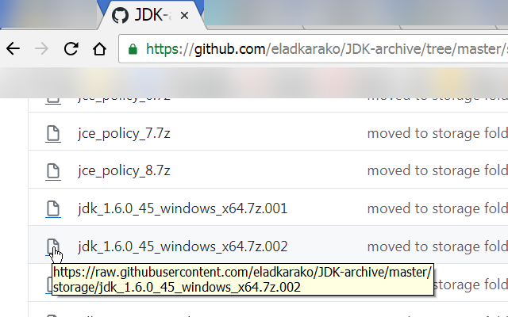
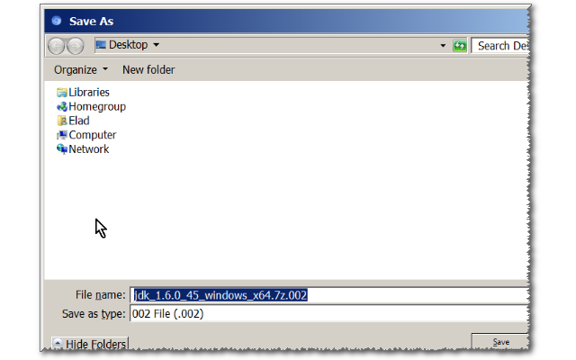

<h1> GitHub-Download-Link</h1>

☞︎ raw file view or download, by clicking the file-icon (force download by right-click, save-as..).

Both functionality and making an unused area functional. Nice!  

That file-icon is now your shortcuts to the raw file.  

Right click it and 'Save As...' to save it directly, without viewing it.  
It preserves the original file-name and does not adds '.txt' at the end. Fun!  

Quirks (as a result of the GitHub AJAX navigation/cache):  
- If you do not see the underline under the icon, try hard-reloading the page (<kbd>CTRL<kbd>+<kbd>F5<kbd>).  
- I've tried to force download every-time instead of viewing, but it does not work for GitHub for some reason, so we will enjoy it as a feature (raw view/download by request).

=-=-=-=-=-=-=-=-=-=-=  

  
  
  

=-=-=-=-=-=-=-=-=  

<blockquote><code>I've basically made this web-extension for myself, and then decided to share it with everyone, because sharing is caring. it's nothing fancy but it is small, quick and it works. If you've enjoyed using it I'll be thrilled to hear all about it in the review section.</code><blockquote>  
<blockquote><code>The Web-extension is 100% completly free, and with full functionality. There are is no data-collections, no analytics, tracking or use of any cookies or cache or storage. No external resources geting/sending and no file-system access. The web-extension works entirly offline.</code><blockquote>  
<blockquote><code><a href="https://github.com/eladkarako/chrome_extensions/issues/new?title=GitHub-Download-Link%20-%20"><em><code>ask something/report a bug</code></em></a>.</code><blockquote>  
<blockquote><code><a href="https://paypal.me/e1adkarak0/5"><em>buy me a coffee ☕︎</em></a>.</code><blockquote>  
