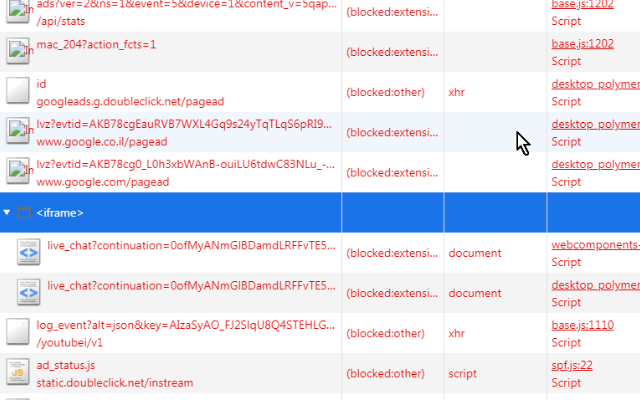

<h1> Micro-Block</h1>
<a href="https://paypal.me/e1adkarak0/5"><em>buy me a coffee ☕︎</em></a>  
<a href="https://github.com/eladkarako/chrome_extensions/issues/new?title=Micro-Block%20-%20"><em><code>ask something/report a bug</code></em></a>  

<strong>Ads-Firewall. Tiny And Fast. Uses declarativeNetRequest - no JavaScript!</strong>

=-=-=-=-=-=-=-=-=  

This is sort of an experiment...
Not sure if any Firefox actually supports it just yet... 
you should probably ask for it in here: https://bugzilla.mozilla.org/show_bug.cgi?id=1435559 ...  
It works in "developer" browsers such as Chrome Canary, Chrome Dev and Chromium.  

=-=-=-=-=-=-=-=-=  

Blocks those protocols:  
pings/beacons/hyperlink-auditings, WebSockets, CSP-Reports.  

Blocks many common analytics, ads, statistics and logs requests.  

=-=-=-=-=-=-=-=-=  

<strong>Keeps your privacy better than any other ad-blocking web-extension</strong>  
Not to scare you or anything, but normally, ad-blocker web-extensions require extensive permissions to be able to block network-requests. This means that they are aware of any request the browser done. This can be potentially leaking-point of a lot of personal data!  
<strong>This web-extension does not uses JavaScript.</strong>  
It only contains few JSON (basically text) files,  
it does not contain any active component, it does not know (or care) anything about your browser.  
It does not do any "inspecting", the blocking is done by the browser itself.  
Also, all the blocking-rules are pre-included in the web-extension already, and I'm not doing any updating or fetching from a remote-location, as I was saying, I can not, this web-extension does not has any JavaScript!  

=-=-=-=-=-=-=-=-=  

<strong>The blocking is faster than other ad-blockers</strong>  
Normally ad-blockers adds network event-listeners, those slows down browsing,  
by design, this disables the (very important!) ability to parallel download network resources, since at some-point there is a bottle-neck of a dynamic method that figures-out if the resources should be blocked or not,  
it also requires the web-extension to be persistent (live in the background as a service) which drain a lot of RAM.  
With this web-extension, the browser does the blocking internally, so network traffic can be as parallel as it gets (pipelining and all...) and the static set of rules means that the browser can handle blocking in an efficient manner.  

=-=-=-=-=-=-=-=-=  

<strong>The blocking is faster than HOSTS-blocking</strong>  
HOSTS require the request "to leave" the browser, resolving the name to IP using the computer's DNS service.  
If you block domains to the <code>0.0.0.0</code> IP, the resolving will be faster,  
but using the <code>declarativeNetRequest</code>-API means the request is blocked before it leaves the browser,  
it does not require additional processing of the browser's (lets face it - cr^ppy) network-process.  

=-=-=-=-=-=-=-=-=  

<strong>The blocking is more accurate than HOSTS-blocking</strong>  
The rules can match other-parts of a request, but the domain,  
this enables blocking of all requests that has <code>"/pixel"</code> in it, for example.  

=-=-=-=-=-=-=-=-=  

<strong>Blocks YouTube video-ads!!!</strong>  
along with many (so many!) side-load logs and statistics.  
This makes YouTube a lot faster.  
Note that YouTube knows when you block its video-ads,  
and it will still show you banners sometimes. But no annoying (and sometime jump-scarring) video-ads!!!  
Also, see "collapsing IFRAMEs" below, there is SOME visual ad-blocking (it's built-into the API itself).  
Note: that I find the live-stream chat useless, annoying and a huge performance-hit (a lot of background requests!) so I've blocked requests to <code>youtube.com/live_chat</code> too. Live-streams will stream a lot smoother and the browser won't slow-down. If you like the live-stream chat, sorry.. You can open a "new issue" (bug report) under https://github.com/eladkarako/chrome_extensions/issues/new and explain to me why it is important to you. and I'll give you a custom version of the web-extension without it being blocked.  

=-=-=-=-=-=-=-=-=  

<strong>Collapsing blocked IFRAMEs</strong>  
<code>declarativeNetRequest</code>-API, by design, tells the browser to visually-hide any IFRAME elements that their source was blocked with it. This is a cool feature since you won't be left with big empty squares and white-spaces when blocking banners. It (currently) only applies to IFRAMEs so you might want to look for a pure-CSS "visual ad-blocker" to hide the leftover containers, look for "Pleasant-Web" web-extension, or fork and tweak it yourself (it's only few CSS files).  

=-=-=-=-=-=-=-=-=  

<strong>AdGuard DNS!</strong>  
I strongly suggest to set your router's DNS servers to <code>176.103.130.130</code> and <code>176.103.130.131</code>. You can have a better web-experience for all your devices. It does not require you to install anything or modify your devices (Best not to change a DNS for a specific device otherwise it won't access the router's DNS and won't be able to see other devices in your home-network, but globally in the router's ISP settings is fine!).  

=-=-=-=-=-=-=-=-=  

<strong>Note: It does not require manifest v3 (don't worry if you don't know what it means)</strong>  
It seems to work fine when I use standard manifest v2,  
although if you have an old(er) browser, you might want to pre-activate the flag (if you have any) to use experimental-features in the web-extensions.  
On Chrome you can use <code>chrome://flags/#extension-apis</code> or if you can't find it just use command-line switches:  <code>--enable-experimental-extension-apis</code> (and maybe <code>--enable-devtools-experiments --enable-experimental-web-platform-features</code> too).  

=-=-=-=-=-=-=-=-=  

<strong>Note: A folder named <code>/_metadata/</code></strong>  
Will be created in the web-extension's folder when you install it, it is a browser-generated folder for caching the JSON-rules into something the browser can work with more efficiently (it is a semi-binary format, you can open it with a Notepad2/Notepad++ and still most of it). You can safely delete this folder if you wish so, the browser will auto-generate it again the next time it will load the web-extension (usually the next time you'll start the browser or if you'll use the developer-mode and click the reload button).  

=-=-=-=-=-=-=-=-=  

I've basically made this web-extension for myself, and then decided to share it with everyone, because sharing is caring. it's nothing fancy but it is small, quick and it works. If you've enjoyed using it I'll be thrilled to hear all about it in the review section.  

100% free (as beer..), include no ads (I hate those!), does NOT collect any data, includes NO analytics and works entirely offline.  

  

<pre>
Developer's HUB / Changelog

1.0.0.4
* initial.
</pre>

