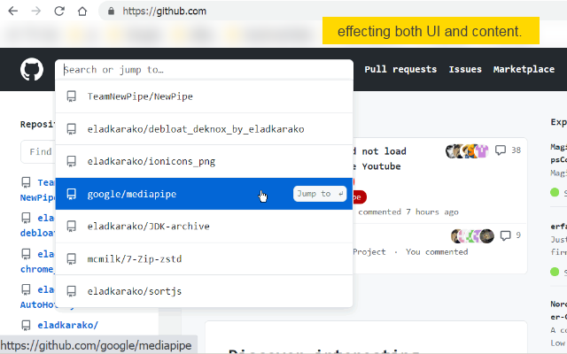

<h1> Monospace-GitHub</h1>

<strong>☞︎ makes everything use monospace font-family.</strong>  

A pure CSS theme manipulator to make GitHub website use a monospace font-family.

  
  

<pre>
Developer's HUB / Changelog

1.0.0.1
+ initial.
</pre>

<a href="https://github.com/eladkarako/chrome_extensions/issues/new?title=Monospace-GitHub%20-%20"><em><code>ask something/report a bug</code></em></a>  
<a href="https://paypal.me/e1adkarak0/5">Support This Project / <em>Buy Me A Coffee ☕︎</em></a>  
