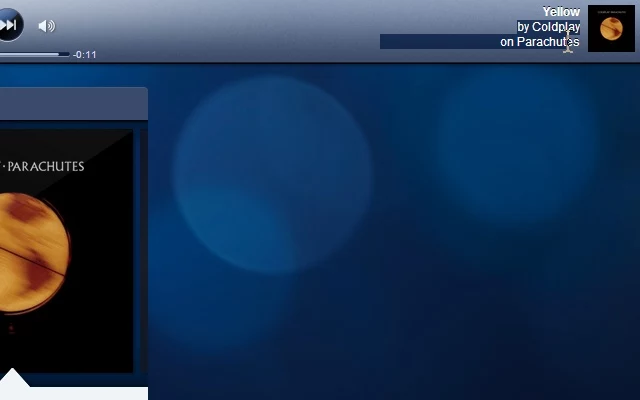

<h1> Pandora-Text-Select-Enabler</h1>

<strong>☞︎ Remove Text Protection 🔓, And Re-Enable Text Select/Copy 📖 Across The Whole Website.</strong>

This web-extension disables the copy/selection protection in pandora.com website, 
it allows you to select copy text across the whole website without restrictions 
(including artist and song details, and lyrics-content). 

Here is how it works (developers):
<ol>
  <li>
  Pure CSS3 fix (<code> !important</code>) to override marking of several elements 'unselectable', 
  this solution helps in-case there is a delay or the JavaScript injection won't work for some reason.
  </li>
  <li>
  JavaScript fix: 
    <ul>
      <li>
      removing attributes that marks elements in the page as 'unselectable'.
      </li>
      <li>
      nulli'fying/removing inline-event handlers that blocks copy/selection actions.
      </li>
      <li>
      inline-CSS text nulli'fying/fixing to unblock/re-allow user-interaction with DOM-elements (<code>pointer-events</code>/<code>touch-action</code> override).
      </li>
    </ul>
  </li>
</ol>

I've basically made this web-extension for myself, and then decided to share it with everyone, because sharing is caring. it's nothing fancy but it is small, quick and it works. If you've enjoyed using it I'll be thrilled to hear all about it in the review section. 

100% free (as beer..), include no ads (I hate those!), does NOT collect any data, includes NO analytics and works entirely offline.

<h3>This Extension Is A Great Way To Copy Your Favorite Lyrics, Or Use It If You Feel Like No-One Should Block Your Browser-Usability, Ever!</h3>

  
  
  
  

<!--  -->
<a href="https://github.com/eladkarako/chrome_extensions/issues/new?title=Pandora-Text-Select-Enabler%20-%20"><em><code>ask something/report a bug</code></em></a>  
<a href="https://paypal.me/e1adkarak0/5USD"><em>buy me a coffee ☕︎</em></a>  
