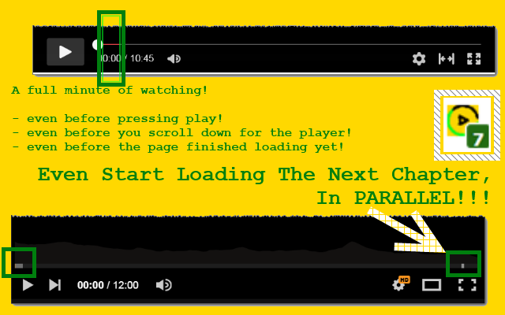

<h1> PreLoad</h1>
 <a href="https://paypal.me/e1adkarak0/5"><em>buy me a coffee ☕︎</em></a>  
 <a href="https://github.com/eladkarako/chrome_extensions/issues/new?title=PreLoad%20-%20"><em><code>ask something/report a bug</code></em></a>  

<strong>☞︎ Sets all video and audio to preload (cache, a.k.a download before playing) the content.</strong>  

This web-extension makes video and audio players start caching the actual video and audio data as soon as the page loads, without waiting to the user to click play. By doing so, by the time you'll scroll and reach the play-button, the player will already establish a connection (which in itself will speed things up) and will start caching without playing the content. The "magic" here is how faster the web-extension is, in reaching the players on the web-page. Works for all HTML5 players even ones that has custom controls, ones that use plain one file streaming and complex HLS/DASH ones. All will benefit from it! 
It works seamlessly does not require any settings or configurations, the only UI provided and needed is a little number over the tag that reveals how many video and audio players have benefited from early-start caching, enabling you to start play the content faster.

in chrome, provent lazyloading (delay load) of meta data (regardless if you use this web-extension) by specifying: <code> --disable-features=PreloadMetadataLazyLoad</code> (after <code>chrome.exe </code>. 
this will fix the lag new browsers have.

=-=-=-=-=-=-=-=-=-=-=-=-=-=-=-=-=-=-=-=  

I've basically made this web-extension for myself, and then decided to share it with everyone, because sharing is caring. it's nothing fancy but it is small, quick and it works. If you've enjoyed using it I'll be thrilled to hear all about it in the review section. 

100% free (as beer..), no ads (I hate those!), no cookies, NO data collection, NO analytics, NOT accessing FS, NOT sending or receiving anything and works entirely offline.

=-=-=-=-=-=-=-=-=-=-=-=-=-=-=-=-=-=-=-=  

  

  

