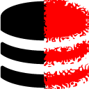
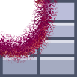
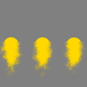
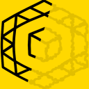
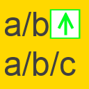

<strong>chrome_extensions</strong> 
Install <a href="https://github.com/eladkarako/chrome_extensions/releases/tag/LatestFirefox">Latest Releases - Firefox</a> (yep, it's signed by Mozilla!) 
Install <a href="https://github.com/eladkarako/chrome_extensions/releases/tag/LatestChrome">Latest Releases - Chrome</a> 
 
 
<strong>Complete Readme/Changelog:</strong> 
 <a href="Align-Left/README.md"                           > Align-Left</a>
 <a href="Anchor-Element-Add-Title/README.md"             > Anchor-Element-Add-Title</a>
 <a href="API-Killer-Battery/README.md"                   > API-Killer-Battery</a>
 <a href="API-Killer-Beacon/README.md"                    > API-Killer-Beacon</a>
 <a href="API-Killer-Beacon-NextGen/README.md"            > API-Killer-Beacon-NextGen</a>
 <a href="API-Killer-Canvas/README.md"                    > API-Killer-Canvas</a>
 <a href="API-Killer-Cookie/README.md"                    > API-Killer-Cookie</a>
 <a href="API-Killer-DeviceMotion/README.md"              > API-Killer-DeviceMotion</a>
 <a href="API-Killer-Font/README.md"                      > API-Killer-Font</a>
 <a href="API-Killer-GeoLocation/README.md"               > API-Killer-GeoLocation</a>
 <a href="API-Killer-History/README.md"                   > API-Killer-History</a>
 <a href="API-Killer-IndexedDB/README.md"                 > API-Killer-IndexedDB</a>
 <a href="API-Killer-Mutation/README.md"                  > API-Killer-Mutation</a>
 <a href="API-Killer-Presentation/README.md"              > API-Killer-Presentation</a>
 <a href="API-Killer-Storage/README.md"                   > API-Killer-Storage</a>
 <a href="API-Killer-SVG/README.md"                       > API-Killer-SVG</a>
 <a href="API-Killer-WebAssembly/README.md"               > API-Killer-WebAssembly</a>
 <a href="API-Killer-WebRTC/README.md"                    > API-Killer-WebRTC</a>
 <a href="API-Killer-WebShare/README.md"                  > API-Killer-WebShare</a>
 <a href="API-Killer-WebSocket/README.md"                 > API-Killer-WebSocket</a>
 <a href="API-Killer-WebSQL/README.md"                    > API-Killer-WebSQL</a>
 <a href="Archive-Links/README.md"                        > Archive-Links</a>
 <a href="AutoComplete-Enabler/README.md"                 > AutoComplete-Enabler</a>
 <a href="AutoPlay-Nay/README.md"                         > AutoPlay-Nay</a>
 <a href="Behind-The-Asterisks/README.md"                 > Behind-The-Asterisks</a>
 <a href="Boostaler/README.md"                            > Boostaler</a>
 <a href="CORS/README.md"                                 > CORS</a>
 <a href="Developer-Mozilla-Fix-NextGen/README.md"        > Developer-Mozilla-Fix-NextGen</a>
 <a href="eBay-Larger-Images-NextGen/README.md"           > eBay-Larger-Images-NextGen</a>
 <a href="eBay-Boxed/README.md"                           > eBay-Boxed</a>
 <a href="eBay-Sorters/README.md"                         > eBay-Sorters</a>
 <a href="eBay-UnPromote/README.md"                       > eBay-UnPromote</a>
 <a href="Editable/README.md"                             > Editable</a>
 <a href="Ellipsis-Fix/README.md"                         > Ellipsis-Fix</a>
 <a href="EMDR/README.md"                                 > EMDR</a>
 <a href="Enabler/README.md"                              > Enabler</a>
 <a href="GitHub-Download-Link/README.md"                 > GitHub-Download-Link</a>
 <a href="GitHub-Download-List/README.md"                 > GitHub-Download-List</a>
 <a href="ImageAlt/README.md"                             > ImageAlt</a>
 <a href="Invert/README.md"                               > Invert</a>
 <a href="Lazify/README.md"                               > Lazify</a>
 <a href="Linkify/README.md"                              > Linkify</a>
 <a href="Loop/README.md"                                 > Loop</a>
 <a href="Meta-Refresh-Killer/README.md"                  > Meta-Refresh-Killer</a>
 <a href="Micro-Block/README.md"                          > Micro-Block</a>
 <a href="MirrorX/README.md"                              > MirrorX</a>
 <a href="Override-NewTab/README.md"                      > Override-NewTab</a>
 <a href="Pandora-Text-Select-Enabler/README.md"          > Pandora-Text-Select-Enabler</a>
 <a href="Pleasant-Web/README.md"                         > Pleasent-Web</a>
 <a href="PreLoad/README.md"                              > PreLoad</a>
 <a href="Reddit-Old/README.md"                           > Reddit-Old</a>
 <a href="Reddit-Old-NextGen/README.md"                   > Reddit-Old-NextGen</a>
 <a href="Remove-Redirects-Plus/README.md"                > Remove-Redirects-Plus</a>
 <a href="Save-Data/README.md"                            > Save-Data</a>
 <a href="Smooth-Scroll/README.md"                        > Smooth-Scroll</a>
 <a href="Speedy-Rendering/README.md"                     > Speedy-Rendering</a>
 <a href="SpellCheck-Enabler/README.md"                   > SpellCheck-Enabler</a>
 <a href="SPF-Killer/README.md"                           > SPF-Killer</a>
 <a href="UnLazy/README.md"                               > UnLazy</a>
 <a href="Unsecure/README.md"                             > Unsecure</a>
 <a href="Up-Level/README.md"                             > Up-Level</a>
 <a href="UserAgent/README.md"                            > UserAgent</a>
 <a href="XDA/README.md"                                  > XDA</a>

 
 <a href="https://github.com/eladkarako/chrome_extensions/issues/new?title=I%20have%20got%a%question%20about%20-%20"><em><code>ask something/report a bug</code></em></a>
 <a href="https://paypal.me/e1adkarak0/5USD"><em>buy me a coffee ☕︎</em></a>
