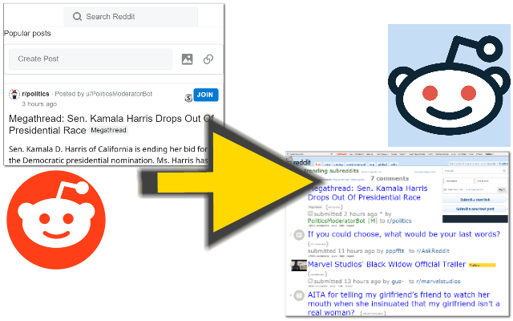

<h1> Reddit-Old</h1>

<strong>☞︎ Fix URLs to point to the old Reddit domain: old.reddit.com</strong>

I like the look&amp;feel of the old reddit website better than the new one, 
it doesn't requires JavaScript nor cookies to render (if you don't need to login), 
it loads a lot faster and you can view the entire discussion-tree without clicking too much buttons.

This web-extension fixes links that normally points to www.reddit.com or amp.reddit.com, 
to point to old.reddit.com, it has the same content but it uses the older look&amp;feel.

It also replace np.reddit.com to old.reddit.com, which means you may vote/comment in those thread with ease again.

This web-extension also helps you if you've already clicked a link to www.reddit.com (or amp.reddit.com) 
by stopping the page-load asap and redirecting to the same address but with old.reddit.com .

I've basically made this web-extension for myself, and then decided to share it with everyone, because sharing is caring. it's nothing fancy but it is small, quick and it works. If you've enjoyed using it I'll be thrilled to hear all about it in the review section. 

100% free (as beer..), include no ads (I hate those!), does NOT collect any data, includes NO analytics and works entirely offline.

<!--  -->
<a href="https://github.com/eladkarako/chrome_extensions/issues/new?title=Reddit-Old%20-%20"><em><code>ask something/report a bug</code></em></a>  
<a href="https://paypal.me/e1adkarak0/5USD"><em>buy me a coffee ☕︎</em></a>  