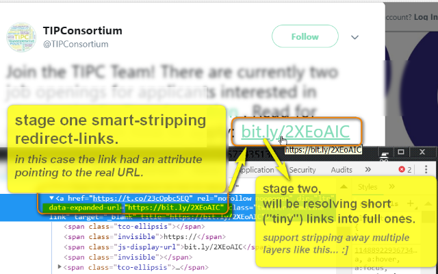
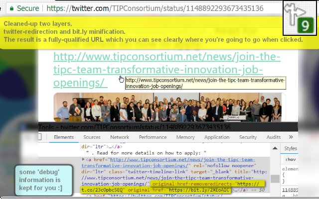

<h1> Remove-Redirects-Plus</h1>
<a href="https://paypal.me/e1adkarak0/5"><em>buy me a coffee ☕︎</em></a>  
<a href="https://github.com/eladkarako/chrome_extensions/issues/new?title=Remove-Redirects-Plus%20-%20"><em><code>ask something/report a bug</code></em></a>  

<strong>☞︎ Smart Redirects-Removal and UnShortening Tiny-Links (Two Stages).</strong>

<blockquote>
This web-extension removes redirects and UnShort tiny-URLs to reveal the long, real, and direct URLs, 
it works in the background, resolving redirect-URLs and fixing links directly on the page without you need to do anything, it saves you time, keeping you secure, preventing you to "walk through" redirect-servers, 
it allows you to see the target of the link while you hover the mouse-above it so you'll be fully aware where you're "going to go".

This web-extension is the next-generation of an older web-extension of mine named <em>Remove-Redirects</em>, which only worked offline, and another web-extension of mine named <em>UnShorts</em> that used <code>https&#x003A;//unshorten.me/s/</code> <del>and <code>http&#x003A;//9inchurl.com/api.php?url=</code></del> to resolve tiny-links to long ones.

<em>I've got the idea combining them from this feature-request: <a href="https://github.com/eladkarako/chrome_extensions/issues/4">https://github.com/eladkarako/chrome_extensions/issues/4</a> by <a href="https://github.com/grahamperrin">&#x0040;grahamperrin</a>.</em>
</blockquote>

This web-extension works in 3 stages:

<ol>
<li>
  Stage 1: <strong><em>works offline</em></strong>
  this is the classic way, same as in good old <em>Remove-Redirects</em>, 
  by decrypting parts of the <code>HREF</code> or other attributes (<code>onmousedown</code> or <code>data-saferedirecturl</code>, for example - commonly used in Google pages), 
  the web-extension can extract the real-URL and place it in the <code>HREF</code> attribute.
  
  In this stage, the web-extension also works hard to clean-up click-event-hooks (<code>onmousedown</code>), 
  leaving you with a standard link, pointing to the real-URL.
</li>

<li>
  Stage 2: <strong><em>UnShort tiny links</em></strong>
  The web-extension has a list of many tiny-url/short-links provider domains, 
  it then scans the page, and try to resolve the <strong>true, long-URL</strong> behind the tiny-URL, 
  this stage requires an online-access, and it uses free web-API such as 
  <code>https://unshorten.me/s/...</code> <del>and <code>9inchurl.com/api.php?url=...</code></del>.
  
  The page-links are then <strong>get updated</strong> with the real-long URL, 
  saving you clicks, 'walking through' redirect-pages (and seeing ads..).
  
  The first stage saves this stage some traffic...
</li>

<li>
  Stage 3: <strong>NEW - <em>Background Offline Resolving</em></strong>
  This web-extension also sits in the background <em>just like a firewall</em>, 
  extracts the real-URL from an out-going request, just before it gets created, 
  it then provides the browser with the cleaned URL instead, to continue the request.
  
  This stage does not requires online-access, 
  it works entirely offline, in a similar way to stage 1, 
  but while stage 1 got the entire-DOM to draw information from 
  (for example, element's attributes such as '<code>data-url</code>' or '<code>onmousedown</code>'), 
  this stage "can only work with" the URL itself, 
  matching it against several sets of rules and regular-expressions matching.
  
  
  This stage does not inject JavaScript into the page, 
  so it will keep working even if stages 1 and 2 will be blocked, 
  for example on pages that block external JavaScript.
  
  <strong>I've just recently added this feature :)</strong>
</li>

</ol>

<strong>When will this web-extension only work partially?</strong>
Some servers can prevent external-JavaScript from running on their pages, this includes JavaScript from web-extensions. It is usually done by serving the web-page with an additional 'Content-Security-Policy' header with the value 'default-src none', for example (https://addons.mozilla.org does it, and it prevents all, no just mine, web-extensions from working on that sub-domain). There isn't much to do in that matter, Firefox was designed to block web-extensions' JavaScript in those cases (yes, this web-extension's JavaScript too). When ever possible, I add an additional network-filter to each of my web-extension, for an increased security, those will always keep on working.

I've basically made this web-extension for myself, and then decided to share it with everyone, because sharing is caring. it's nothing fancy but it is small, quick and it works. If you've enjoyed using it I'll be thrilled to hear all about it in the review section. 

100% free (as beer..), include no ads (I hate those!), does NOT collect any data, includes NO analytics and works entirely offline.

  

  

<pre>
Developer's HUB / Changelog

2.1.5.229
+ move logic to a browser-handled async block, by keeping 'action' as normal function, and moving all logic into a secodary 'async function async_action(){____}' block (which returns a promise, which isn't used for now). it simulates an old 'setTimeout(FUNCTION,0)'.

2.1.5.228
+ adding unshort (short link to long link using a background network-resolving with extenal-API or native resolving using own browser when possible) to those domains: affiliation.appgratuites-network.com, bitly.com, buff.ly, chip.biz, cnn.it, cnnmon.ie, cos.as, dopice.sk, dustn.ws, ed.cl, engt.co, feedproxy.google.com, flip.it, glm.io, ht.ly, htn.to, hukd.mydealz.de, ift.tt, kck.st, kcy.me, mdk.to, menea.me, mhlthm.ag, mun.do, nazr.in, nerdi.st, ohmyyy.gt, phon.es, po.st, pulse.me, redes.li, reut.rs, sns.mx, spon.de, spr.ly, tmblr.co, trib.al, untp.i, url.cn, v0v.in, v.ht, vrge.co, wh.gov, y2u.be  .

2.1.5.227
- removing 'http://9inchurl.com/api.php?url=' since '9inchurl.com' domain expired, and the API is no longer available.

2.1.5.226
+ add support for 'mir.cr' short-links.
* prefer 'https://unshorten.me/s/' to run first, and 'http://9inchurl.com/api.php?url=' second (if not resolved yet) --- since 'http://9inchurl.com/api.php?url=' ends-up with HTTP-STATUS '504 Gateway Time-out' most of the time.

2.1.5.225
* removing support for 'pulsar.ebay.com', and reverting to 'xhr.withCredentials = false' again.

2.1.5.224
+ add support to unshort 'pulsar.ebay.com' links. all the data is in the HREF, but it's encrypted. I only 'send it' to be resolved locally in the background, it means your computer needs to be able to resolve 'pulsar.ebay.com' (meaning - don't block it in your HOSTS file or your AdBlock extension), the unshortening services can not handle it, I suspect the decrypting is done in server-side along with the client-cookie data. pulsar.ebay.com is eBay ad/redirect/click-tracking services (among many others).
* explicitly mark the result of unshortening link as invalid if the result is 'https://www.ebay.com/' or something like that without meaningful path or arguments, this is since 'http://9inchurl.com/api.php?url=' and 'https://unshorten.me/s/' CAN NOT resolve those links (it needs cookies probably to be decrypted in server-side in whatever algorithm used, so it can only resolved using the own computer's resolving from within eBay). this also means the XMLHttpRequest object now uses 'xhr.withCredentials = true', I currently test to see if I can narrow it down to limit exposure of cookie data).

2.1.5.223
* improve removing-redirects from embedly, mostly with 'background_request_manipulation.js', first addressing argument 'src' then 'url'.

2.1.5.222
+ adding support for unshortening 've42.co' short-links.

2.1.5.221
+ fixing (f!#@$) websites that uses A-element without HREF but only 'data-redirect' such as we4g.co.il . this is not exactly why I've developed the web-extension, since it is not really a redirect, but a HREF end-target, still - useful. I leave the attribute intact since this way it makes the DOM-element more informative, but due to the (pretty nice) way 'Remove Redirects (Plus)' works it disconnects any existing event-listeners from the node. Sadly this is a DOM-only fix, meaning it only works with javascript support on the page.

2.1.5.220
+ adding support for visualiq-clickpixel-redirects - both on page and background request-manipulation (for examples:  https://t.myvisualiq.net/click_pixel?&red=https%3A%2F%2Fexample.com ).

2.1.5.219
+ adding support for pre-fixing links on the page with 'Download_Redirect/l.php?......' WordPress redirect-plugin.
+ adding support for background request redirect removing of 'Download_Redirect/l.php?......' WordPress redirect-plugin.

2.1.5.218
+ background_request_manipulation.js - provide additional check when possible for parsing a generically valid URL string, in-case it does not, avoid the redirect for the URL (for example some URLs such as 'https://c0.wp.com/c/5.4.2/' can not be stripped out of the 'c0.wp.com', not that they should since the rule specify 'i\d+.wp.com', but in a similar case the hostname might be 'c', lack of '.' in the hostname is a sign to avoid the redirect (standard request) although it can be 'localhost' or something made-up such in the HOSTS file..)

2.1.5.217
* fixing URL-strings (in background_request_manipulation.js) - missing protocol - add 'https://', implicit protocol ('//') - add 'https:', if initiator exists and is 'https:' - make sure request is too (mostly usable for media/scripts/styles to avoid 'mixed-mode'), if initiator is not availble - skip fixing that.

2.1.5.216
- not trying to resolve "pulsar.ebay.com" anymore using the short-to-long-URL. It just gives the homepage (included data is encrypted in some manner as a GET-'payload')

2.1.5.215
* fixed query: in 'at_document_start.js' --- query must never include '//' characters one after the other! (I match more accuratly in a later regex in 'at_document_start.js' and 'background_request_manipulation.js' which is fine).

2.1.5.213
+ adding support for offline-resolving (regex-match) of 'pixel.' subdomain redirect services, usually distributed as 'everesttech.net' links, and commonly used in Amazon-self-promotion ads on the first results in Google-search.  -- both in offline JavaScript-client-engine and the offline-background-pre-request resolver.

2.1.5.212
* improving the online-short-URLs resolver with more error cases.

2.1.5.211
+ adding support for "www.qrli.to" (and "qrli.to").

2.1.5.210
+ adding support for removing-redirections for 'anonymz.com' (same as 'anonym.es') both in links and in pre-request parsing (when browsed witout the web-extension client-side support) to skip the request. This is an offline real-URL extraction-rule.

2.1.5.209
+ adding support for Microsoft sharepoint-short-URLs, not a specific company custom ones, just: 'surl.link', 'surl.ms', 'officeurl.com', 'sharepointurl.com'.

2.1.5.208
+ adding support for 'db.tt' domains.

2.1.5.207
+ improve security by cleaning-up tracking-related attributes from links.

2.1.5.206
+ adding support for unshort Microsoft links: "aka.ms".

2.1.5.205
+ adding support for generic Google redirect: google.___/url___url=____ .
+ adding support for CloudflareApps redirect: /go/?http___ .

2.1.5.204
+ adding support for stripping real links from common-vBulletin-redirector-simple-PHP-plugin - '/redirector.php?url=___' .
+ adding support for stripping real links from anonym.es links.
+ including above added-support to background-resolver as well.

2.1.5.203
+ adding support for 'cdn.embedly.com/...&url=___' which is an IFRAME service commonly used in reddit.

2.1.5.202
+ adding support for 'i*.wp.com/...' cache-links.
+ fixing regex match amp-project.
+ adding 'i*.wp.com' (wordpress-cache) and amp-project links to raw background-request-filter ('background_request_manipulation.js').

2.1.5.201
+ adding support for AmpProject-redirects (when used as a WordPress plug-in), bringing back the original URL.
* some code-changes in the particle-extraction for the URL, adding support for non-decoding end-componenet, supporting redirect that uses the page URL as a suffix (A.pathname) instead of an argument (A.search), but still falling back to default-decodeURIComponent (way it was used until now..).

2.1.4.114
* bug fix: "//" to "/" in the query string used [2.1.4.112] --- in I can not use "//" in the document.querySelectorAll for some complex combination of regex-replacements, it will result with an invalid query-phrase due to removal of some parts of the string.

2.1.4.112
+ adding support for Moz!lla-outgo!ng saf3-l!nks.

2.1.4.111
+ adding a network-component that works just like stage 1 - matching a redirect-URL against regular-expressions, tring to extract the real-URL from it - it then provides the browser with the better, cleaner URL. This stage works in the background even when the page will block JavaScript injections on to the page itself. There is only offline matching against set of rules/regex-s no online querying - so it is very fast.

2.1.3.207
* adding support for links with real href placed in 'data-original-href-url' attribute (www.reddit.com and old.reddit.com).

2.1.3.206
* improving cleanup of 'utm_*' URL-arguments from elements with 'HREF'-attributes.

2.1.3.205
+ also clean-up tracking arguments from 'A'-like-elements (utm_source=..., utm_medium=..., ..).

2.1.3.204
+ adding support for mandrillapp.com redirect-links which uses nasty BASE64-encoding and twice JSON-parsing, STRING-regex might be easier but then we have to deal with all that '//' escaping $hit!! - using a (semi-)heuristic method to handle the content.

2.1.3.203
* adding another error-case (timeout error message).

2.1.3.202
+ adding support for offline stripping DropBox download-links, to direct links.

2.1.3.201
+ making the main-action JavaScript run as a repeat 'timed' alarm every 1 minute. Uses "alarms" for the 'timer' and "tabs" for executing JavaScript file. The JavaScript file 'at_document_idle.js' (with just 'action();') will executed starting from 'document_start+1minute' and will repeat every one minute. This is a friendly way running timed code that does not uses setTimeout nor setInterval.

2.1.2.104
* removed logs.

2.1.2.103
+ adding support for 'vaugette.com' short-URL-service.
* prevent repeating resolving invalid-URLs or URLs that won't resolved by sending final-message of an empty-string to the resolved-url as a flag. this will caused the TAG-attribute 'unshorts-processing' (should be 'unshorts-invalid') to prevent the <A>-element from being re-discoverred.

2.1.2.101
* improve engine - the first requesting (GET) using own browser/DNS resolving, alternative onerror/ontimeout/onsuccess handling where everything gets to one handler that adds additional conditions such as server-failures, that single handler needs to be one for each URL (that's 3 - own (plain URL), "http://9inchurl.com/api.php?url=", "https://unshorten.me/s/") .
* improving placing the result (resolved) URL in A-element text-content, sensitive to not erasing its content, and when needed, manipulating '#text'-node (--- 3===nodeType) by '#text'-node - one by one.
+ adding test page, taken from the comment-data of https://www.youtube.com/watch?v=FT80mv3VCBY (Simon And Martina) which uses many short-links.

2.1.1.126
* engine improve.
+ re-adding 'goo.gl' and 'share.epidemicsound.com' .

2.1.1.125
+ first try HEAD-request to resolve 301/302 requests faster and "save API calls", on either of fail (HOSTS block) or no change in the URL, use the web-API of URL-unshort'ning.

2.1.1.124
- do not try to resolve 'goo.gl' domains, the unshort'ning-services can't handle it.

2.1.1.123
* better improving placing resolved links'-text.

2.1.1.122
* also change the extension-icon-title, when the badge-number-overlay changes (extension name with badge-number in brackets).

2.1.1.119
* improve filter-out bad cases of bad responses-from the web-resolving-API (error, polsar.ebay.com resolve failure to ebay-portale, and non-changed URL).

2.1.1.118
* update 'background_main.js' and renamed to 'background_badge.js'.

2.1.1.116
* adding handling of 'pulsar.ebay.com' redirect-links.

2.1.1.115
* rename 'fetch' to 'get' everywhere.

2.1.1.114
* improving fetch-code and request API error-handling (one fallback from 'http://9inchurl.com/api.php?url=...' to 'https://unshorten.me/s/...').

2.1.1.111
* joining Remove-Redirects and UnShorts with other improments to create Remove-Redirects-Plus.

</pre>

