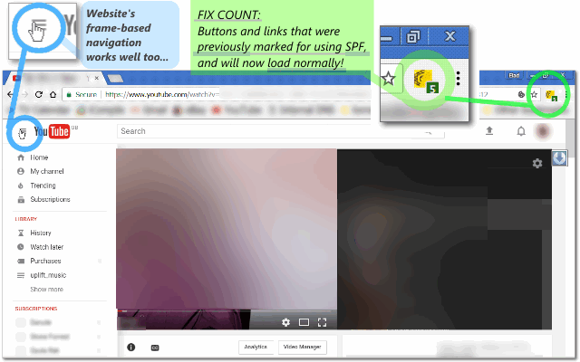

<h1> SPF-Killer</h1>
<a href="https://paypal.me/e1adkarak0/5"><em>buy me a coffee ☕︎</em></a>  
<a href="https://github.com/eladkarako/chrome_extensions/issues/new?title=SPF-Killer%20-%20"><em><code>ask something/report a bug</code></em></a>  

<strong>☞︎ Back To Standard Browsing! ꗷ︎</strong>

Disabling the SPF engine is quite easy,
all you have to do it add <code>/spf.js</code> to your uBlock-origin adblock-list...

read more about it in here: <a href="http://icompile.eladkarako.com/disable-youtube-spf/"><em>iCompile -</em> Disable YouTube SPF</a>
<h3>But <strong>DON'T!</strong></h3>

For YouTube, you can add those to UBlock-origin (under "my filters") reduce some common sh!t
<pre>
youtube.com/api/stats

youtube.com/ptracking

youtube.com/pagead

google.com/pagead

google.co.il/pagead

youtube.com/youtubei/v1/log_event

youtube.com/youtubei/v1/log_interaction

google.com/uds/stats

google.co.il/uds/stats

youtube.com/csi_204

youtube.com/player_204*pagead

youtube.com/player_204*adunit

/videogoodput

youtube.com/get_midroll_info

youtube.com/annotations_invideo*instream_ad

yt1.ggpht.com/proxy

yt2.ggpht.com/proxy

yt3.ggpht.com/proxy
</pre>

many Google based websites do not have a proper fallback to standard-browsing anymore,
leaving you with much of the functionality missing,

Don't belive me?
Try YouTube with uBlock-origin and the custom rule: <code>/spf.js</code>.
Most of the menus will not respond well, and video-transitions in playlist will but unusable.

This is YouTube was not properly coded with a fallback in-case the JavaScript of SPF will be disabled, but the other functionality will kept enabled. So it is best to <strong>keep loading <code>/spf.js</code></strong>, but providing a workaround that will limit the usability of the loading-engine,

Effectivly giving you a <strong>SPF-Free</strong> website, without breaking anything.

<h3><em>SPF-Disabler</em> provides several solutions working heuristically side-by-side, Bringing you back the standard-browsing experience.</h3>

 

<!--  -->

Here are some updated youtube ads-blocking rules for ublock (https://gist.github.com/eladkarako/7ee77942acc066f930de0268c387239e#file-block-youtube-in-video-ads-md):  

1. download ublock origin.
2. put the following rules in the custom rules section:
<pre>
//*youtube.com*adunit
//*youtube.com/*event=
//*youtube.com/*favicon
//*youtube.com/*log_event
//*youtube.com/*pagead-id.js
//*youtube.com/api/stats
//*youtube.com/ptracking
doubleclick.net
doubleclick.com
/generate_204
/pagead

youtube.com##.ytp-ad-progress-list,#player-ads,#merch-shelf
youtube.com##+js(json-prune, playerResponse.adPlacements playerResponse.playerAds adPlacements playerAds)                    youtube.com##+js(json-prune, playerResponse.adPlacements playerResponse.playerAds adPlacements playerAds)
</pre>

optional (sometime the player needs it to bring you back to the same point if you've stopped viewing and came back)
<pre>
@@youtube.com/api/stats/watchtime?$image,domain=youtube.com
</pre>

optional (saves you some CPU)
<pre>
//*youtube.com/live_chat
youtube.com##ytd-live-chat-frame
</pre>