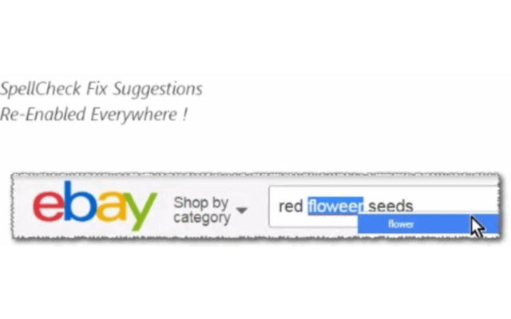

<h1> SpellCheck-Enabler</h1>

This web-extension will allow the built-in spellcheck feature of Firefox to be activated in every text-field, in every-page you visit, regardless if that website allows (or god forbid) blocked the spellcheck feature in that text-field.

<strong>Firefox Users</strong>
You must install at-least one spell-dictionary from:  
https://addons.mozilla.org/en-GB/firefox/language-tools/  

<strong>Chrome Users</strong>
You already have a dictionary, it is native to the language of your browser.
You can replace it or install an additional dictionary, following instructions in: https://www.ghacks.net/2014/04/30/add-languages-google-chromes-spell-checking-functionality/ 

<strong>Note:</strong>
Newer Chromium versions (and maybe Chrome too) won't download the dictionary until you'll visit <code>chrome://settings/languages</code>, 
and switch-ON the languages you wish to use, at that point the browser will try to connect to the one of Google redirector-services to fetch a <code>.bdic</code>-file, 

for example, for English(GB): <code>https://redirector.gvt1.com/edgedl/chrome/dict/en-gb-9-0.bdic</code>, 
which will then resolved to something like: <code>https://r3---sn-nhpax-ua8r.gvt1.com/edgedl/chrome/dict/en-gb-9-0.bdic?cms_redirect=yes&mh=7y&mip=123.45.67.89&mm=28&mn=sn-nhpax-ua8r&ms=nvh&mt=1234567890&mv=m&mvi=2&pl=21&shardbypass=yes</code>. 
Try to make sure you (at least until the download finishes) are not blocking <code>gvt*.com</code>-domains (AdBlock/HOSTS file).

(Clear up anything that matches <code>^.*\.gvt\d+.*$</code> with <code># \1</code> (or <code># $1</code>) to "comment-out" that line.

If you're blocking those domains (AdBlock/HOSTS-file), 
r3---sn-nhpax-ua8r.gvt1.com
</code>-file for example), as I was, you must unblock those, at least one time until the download finishes, 
In your HOSTS file you can "search and replace" 

=-=-=-=-=-=

There is another web-extension (named 'AutoComplete-Enabler') that acts similar way, 
allowing the browser's built-in autocomplete-feature on every text-field, and it synced with your profile as-well. It may save you a lot of typing...

<strong>Additional Note, For Chrome Users:</strong>
There is a way you can make the <strong>spellcheck</strong> process run in the background,  
which is useful on large-amount of texts.  
Either change: <code>chrome://flags/#enable-idle-time-spell-checking</code> (<code>Enable idle time spell checker</code>) to <code>enabled</code>,  
or add to the command-line (just after your <code>chrome.exe</code>) <code>--enable-blink-features="IdleTimeSpellChecking" --enable-features="IdleTimeSpellChecking"</code>.

<strong>When this web-extension will only work partially (not a full API-blocking)?</strong>
Some servers can prevent external-JavaScript from running on their pages, this includes JavaScript from web-extensions. It is usually done by serving the web-page with an additional 'Content-Security-Policy' header with the value 'default-src none', for example (https://addons.mozilla.org does it, and it prevents all, no just mine, web-extensions from working on that sub-domain). There isn't much to do in that matter, Firefox was designed to block web-extensions' JavaScript in those cases (yes, this web-extension's JavaScript too). When ever possible, I add an additional network-filter to each of my web-extension, for an increased security, those will always keep on working.

I've basically made this web-extension for myself, and then decided to share it with everyone, because sharing is caring. it's nothing fancy but it is small, quick and it works. If you've enjoyed using it I'll be thrilled to hear all about it in the review section. 

100% free (as beer..), include no ads (I hate those!), does NOT collect any data, includes NO analytics and works entirely offline.

<!--  -->
<a href="https://github.com/eladkarako/chrome_extensions/issues/new?title=SpellCheck-Enabler%20-%20"><em><code>ask something/report a bug</code></em></a>  
<a href="https://paypal.me/e1adkarak0/5USD"><em>buy me a coffee ☕︎</em></a>  