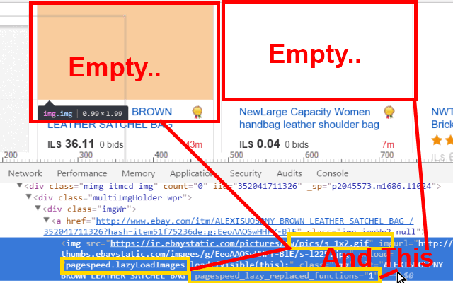

<h1> UnLazy</h1>

This web-extension heuristically tries to kill dynamically-loaded images engines such as Google PageSpeed, then figure-out and place a clean, normal correct image in-place of the lazy-loaded one.

Lazy-loaded resources are beneficial only to the website owners, by saving them some traffic,
For us, the users it usually delays the showing of the images, and making the page heavy, slow and sluggish.

It works great on Amazon and eBay, loading all the images shown in the search-page without delay.
It works nice on YouTube, loading all the thumbnails at once, allowing you a quicker-loading page.
It works on many WordPress-based websites which commonly uses a "lazy load kit", and websites that uses the Google PageSpeed engine and various other websites due to a generic-matching algorithm.

In short, this web-extension will make images show faster.

=-=-=-=-=-=

As of <code>v8.0.6.29</code> this web-extension does <strong>not</strong> including browser's-explicitly disabling of LazyLoading-attributes (loading="eager"/lazyload="off") since it can made dynamic-content pages load 1000x* images (see https://ksp.co.il/) at once. once a normal image has set and a 3rd-party-lazyloading engine has null'ified, the browser may use its own native lazyloading engine, which <strong>a user may disable the native lazyloading of the browser</strong> using Chrome/Chromium - <code>chrome://flags/#enable-lazy-image-loading</code> (set to disable) or command-line "--disable-features=LazyImageLoading" and Firefox- about:config "dom.image-lazy-loading.enabled" (set to false). 

In my experience the native lazyloading works really well, 
you can also try my 'Lazify' web-extension which which improve support for native-LazyLoading, and provide workaround for older browser (better than any other 3rd-party).

=-=-=-=-=-=

Additional developer notes:
- This web-extension also tries to simplify the page's DOM-structure, 
for example when it uses a non-IMG-element to hold an image (a DIV-element), 
placing a clean IMG-element instead, simplifing the DOM-tree structure makes the page faster and more reactive.

- using a simple IMG is better, new browsers have the ability to use your multiple-core CPU to fetch, decode and render images in parallel, some will even make it more efficient and try to deligate the rendering-task to your GPU, making the whole process even more efficient.
LazyLoading breaks those abilities by forcing a linear processing of images, and because it is triggered by user-interaction over UI-components - it both makes the UI slower and slows down the entire image-fetch-render process, LazyLoading is nasty.

=-=-=-=-=-=

<strong>When this web-extension will only work partially (not a full API-blocking)?</strong>
Some servers can prevent external-JavaScript from running on their pages, this includes JavaScript from web-extensions. It is usually done by serving the web-page with an additional 'Content-Security-Policy' header with the value 'default-src none', for example (https://addons.mozilla.org does it, and it prevents all, no just mine, web-extensions from working on that sub-domain). There isn't much to do in that matter, Firefox was designed to block web-extensions' JavaScript in those cases (yes, this web-extension's JavaScript too). When ever possible, I add an additional network-filter to each of my web-extension, for an increased security, those will always keep on working.

I've basically made this web-extension for myself, and then decided to share it with everyone, because sharing is caring. it's nothing fancy but it is small, quick and it works. If you've enjoyed using it I'll be thrilled to hear all about it in the review section. 

100% free (as beer..), include no ads (I hate those!), does NOT collect any data, includes NO analytics and works entirely offline.

<a href="https://github.com/eladkarako/chrome_extensions/issues/new?title=UnLazy%20-%20"><em><code>ask something/report a bug</code></em></a>  
<a href="https://paypal.me/e1adkarak0/5USD"><em>buy me a coffee ☕︎</em></a>  
