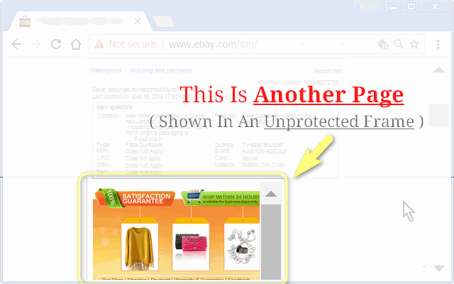
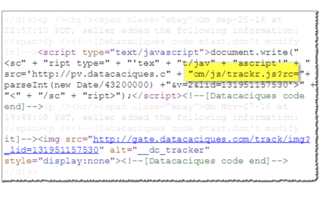
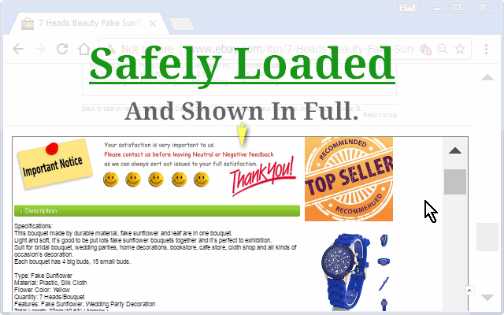
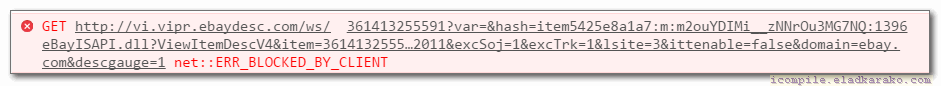

<h1>eBay-Boxed</h1>

Prevent eBay From Leaking Your-Details To China-Vendors!

- Play safe in eBay.
- Prevent items-pages from loading malicious code from China-vendors.
- Prevent China-vendors from tracking your IP and storing malicious forever-cookies to track your identity.

═══════════════════════════════════════════════════

The problem:
───────────────────────────────────────────────────
When you view a product in eBay, 
a small part of the page you're viewing contains an HTML-IFRAME-element, 
that displays another page, coded by the seller, as a part of "their online shop", 
eBay allows the seller to add an unlimited HTML-content which includes images, scripts and even additional IFRAMES, 
the reason is that eBay wants the seller to provide you more information regarding the product, 
in any format the is suitable for the seller.

═══════════════════════════════════════════════════

JavaScript trackers, analytics, pixel-tracking:
───────────────────────────────────────────────────
This web-extension will prevent all JavaScript content from running, 
it will also forbid loading of images from external servers, 
This blocks all dynamic content including trackers and analytics, 
including tracking by pixel-image and collecting data using cookies.
The only permitted content is one placed under eBay servers, 
which is just the text-description and the product-images, which is what we need.

═══════════════════════════════════════════════════

The web-extension works in two-phases:
───────────────────────────────────────────────────
At first, it will stop the initial, unprotected IFRAME-content from being loaded, 
secondly it will recreate the IFRAME, with limitations, and will load it again, 
which this time it will allow to load. 
The newly created IFRAME in the page will be larger and scroll'able, 
allowing you to see all the content easily, 
The green frame-border will help you to know that the process has finished successfully.

═══════════════════════════════════════════════════

Developers can read the technical description of "what is a sandbox-iframe",
and how it is so much better to load questionable-content within it, providing much needed protection for clients,
by reading the following articles:
Play safely in sandboxed IFrames - html5rocks.com : https://www.html5rocks.com/en/tutorials/security/sandboxed-iframes/
IFrame element - developer.mozilla.org : https://developer.mozilla.org/en-US/docs/Web/HTML/Element/iframe

The <code>eBay-Boxed</code> web-extension is 100% free (as beer!), includes NO ADS and NO TRACKING (I hate those!!!) and is completely open-source.

What does this "error" means?

<h2>This Is A Good Thing!</h2>
What you see is the first, unprotected request, being blocked from opened in an unprotected IFRAME,
eBay-Boxed will create a sandboxed iframe at the bottom of the page, loading it,
with the addition of <code>sandboxed=true</code> at the end of the original request, to flag the extension-side,
that "this is ok to load".

It will also load your page faster,
Since all of the China-scripts and analytics-codes from inside the frame will be blocked, having your browser avoid downloading all this junk!

You can read more on my tech. blog, which has the original code,
it was lacking the blocking of the initial request though since before it was just meant for improving visibility by allowing the description frame to be opened- bigger/wider at the bottom of the page :)
[iCompile-  JavaScript Ninja – eBay Page Fix – Cleanup And Main Description](http://icompile.eladkarako.com/ebay-page-fix/)

Happy days!

<a href="https://github.com/eladkarako/chrome_extensions/issues/new?title=eBay-Boxed%20-%20"><em><code>ask something/report a bug</code></em></a>  
<a href="https://paypal.me/e1adkarak0/5USD"><em>buy me a coffee ☕︎</em></a>  
